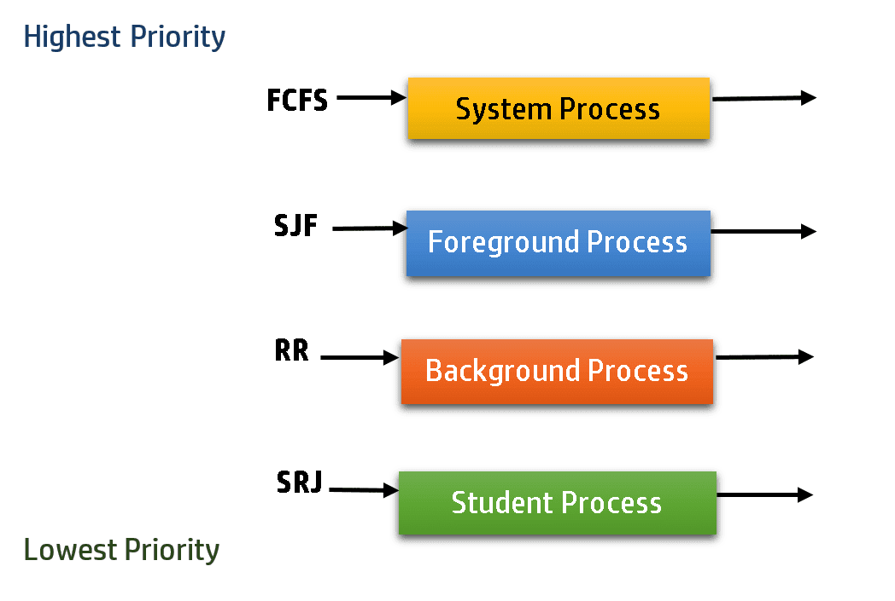

# Scheduling Algorithms Project 

## Introduction

Welcome to my Principles of Computer Systems project on scheduling algorithms. In this project, I explore and compare two key scheduling algorithms: Shortest Job First (SRTF) and Round Robin (RR).

## Scheduling Algorithm Overview

- **Long-term Scheduler (Admission Scheduler):** Admits processes to the ready queue.
- **Medium-term Scheduler:** Handles process swapping between main and secondary memory.
- **Short-term Scheduler (CPU Scheduler):** Allocates CPU to ready processes and makes frequent scheduling decisions.

### Preemptive and Non-preemptive Scheduling

- **Preemptive:** Allows processes to be interrupted and replaced by others.
- **Non-preemptive:** Processes hold the CPU until they release it.

### Goals of Scheduling Algorithms

- Maximize CPU utilization
- Ensure fair CPU allocation
- Maximize throughput
- Minimize turnaround time, waiting time, and response time

## Key Terms

- **Arrival Time:** Process arrival in the ready queue.
- **Burst Time:** Time needed for CPU execution.
- **Completion Time:** Process completion time.
- **Turnaround Time:** Time from arrival to completion.
- **Waiting Time:** Time spent in the ready queue.
- **Response Time:** Time until a process gets CPU time.

## Implemented Scheduling Algorithms

### Shortest Job First (SRTF)

- Preemptive algorithm prioritizing the shortest next CPU burst.
- Minimizes waiting time and maximizes throughput.

### Round Robin (RR)

- Preemptive algorithm with fixed time quantum for each process.
- Ensures fairness and prevents starvation.

## Conclusion

This project explores scheduling algorithms, their objectives, and two implemented algorithms: Shortest Job First (SRTF) and Round Robin (RR). Understanding these strategies helps grasp how operating systems optimize resource management and system performance.

